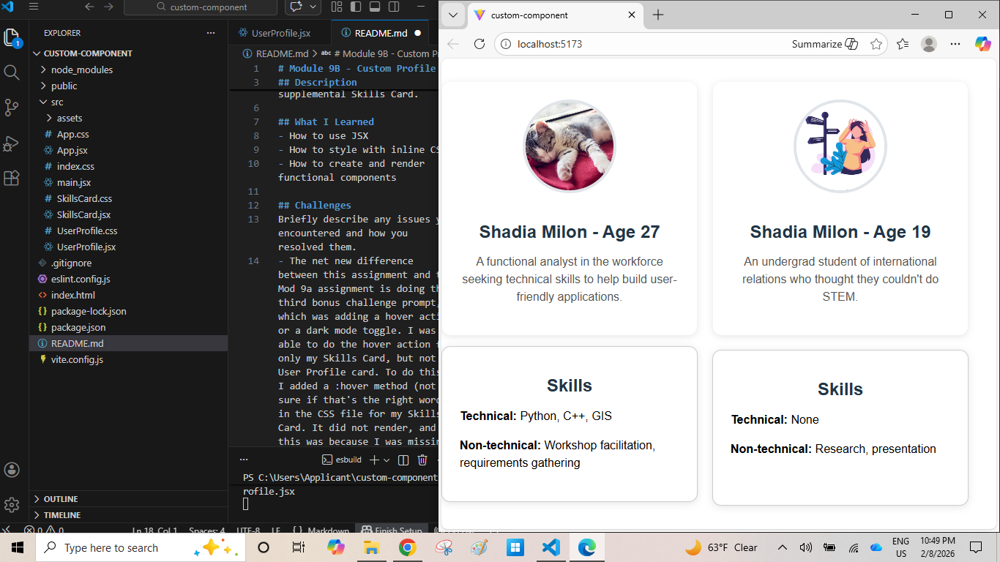

# Module 9B - Custom Profile Component

## Description
This is a React app built with Vite. It contains a profile component styled with inline CSS.
In addition to the exising User Profile card, I added a supplemental Skills Card.

## What I Learned
- How to use JSX
- How to style with inline CSS
- How to create and render functional components

## Challenges
Briefly describe any issues you encountered and how you resolved them.
- The net new difference between this assignment and the Mod 9a assignment is doing the third bonus challenge prompt, which was adding a hover action or a dark mode toggle. I was able to do the hover action for only my Skills Card, but not my User Profile card. To do this, I added a :hover method (not sure if that's the right word) in the CSS file for my Skills Card. It did not render, and this was because I was missing the classname within the section/division. There was no way my SkillsCard.CSS file could tie these behaviors to the SkillsCard component without this. I thought that the component name defined after the function keyword, which represents the component, sufficed, but that was not the case. I didn't understand why I could not apply the hover method successfully to my user profile given that structurally, my user profile card and my skills card are basically the same. I hope to resolve that ahead of my final project.

## Screenshot
Include a screenshot of your component.

      